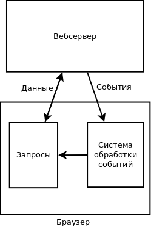
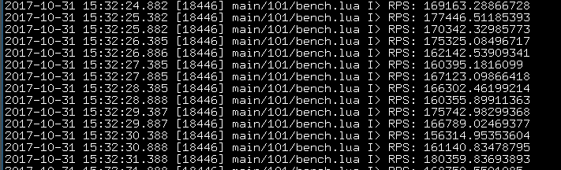

# Tarantool: ~500 строк кода и сервис оповещения миллиона пользователей готов

Tarantool это не просто база данных. Tarantool это app-сервер с базой данных
на борту, поэтому для реализации некоторых вещей, на которые люди тратят
большое количество времени, с Tarantool нужно очень немного ресурсов.

На написание данной статьи меня натолкнула
[эта статья](https://habrahabr.ru/company/tensor/blog/341068/).

Очень много людей в IT-мире занимается одним и тем же. Расскажу о своём опыте
в решении этих же проблем.

Несколько лет назад мы копали ровно ту же задачу: пользователь хочет в
вебприложении в реальном времени (с задержками, определяемыми только сетью)
получать уведомления о тех или иных событиях.

Если рассмотреть требования в указанной статье:

* на странице "слушаем" в среднем 10 событий;
* миллион пользователей;
* требуется персистентность (терять события мы не хотим);



То поскольку данных недостаточно, сделаем дополнительно несколько
допущений/прикидок.

Если это например некий чат, где весь миллион пользователей что-то постоянно
пишет, то сделаем допущение, что один пользователь генерирует одно сообщение
за 10 секунд.

Тогда получим что миллион пользователей генерирует 100 тыс сообщений в секунду.

И тут появляется первый важный аспект: что передаем?

### События или данные?

Это традиционная дилемма всех очередей, аггрегаторов, серверов событий:
что является единицей хранения? Поэтому введем понятия:

* **Событие** - это по возможности **минимальная** информационная структура,
хранящая в себе информацию **о факте** события.

С событием могут быть связаны данные:

* **Данные** - это полный набор данных, в том числе слабо связанных с событием.

Например: пользователь `345` оформил заказ на перевозку груза `X`
из точки `А`, в точку `Б`, при оформлении использована банковская
карта `Z` итп.

Информацию о том кто (источник события) оформил заказ (факт события)
будем называть событием, а информацию откуда транспортируется груз, какой груз,
прочую информацию о пользователе заказе и грузе - будем называть данными.

То есть событие - это структура, описывающая в себе факт события,
а данные это все остальное.

Линия разделения событие-данные условная, но все же.

Пример события:

```json
{
    "type": "order",
    "user": 345,
    "status": "created",
    "orderid": 12345
}
```

Пользователь `345` создал заказ `12345`. Заказ на момент отправки события
имел статус `created` (это уже избыточные данные).

Теперь сформирую некое **эмпирическое** правило правильного архитектурного
выбора:

> При разработке очередей, аггегаторов, серверов событий сервера должны
> манипулировать именно событиями, а не данными.

Однако еще раз повторюсь: линия разделения условная: событие из примера содержит
часть данных (поле `status`).

Итак вернемся к задаче: мы строим именно **сервер событий**, поэтому можем
прикинуть трафик. Возьмем например, что среднее событие будет представлять
из себя JSON-хеш о 4-10 элементах - текст размером 60-160 байт.

То есть поток событий обеспечивающий работу миллиона пользователей
(100 тыс событий в секунду) по средним прикидкам будет составлять от 6 до 16
мегабайт в секунду.

Для того чтобы прокачать этот трафик через один узел сети достаточно
сети с пропускной способностью - 200 мегабит/сек.

Теперь прикинем сколько ресурсов надо на то чтобы доставить эти события
миллиону пользователей.

У каждого конечно своя архитектура, но можно говорить о некоторых общих
принципах.

Скорее всего если одно сообщение надо доставить миллиону пользователей,
то это ошибка в архитектуре (хотя и такое бывает). Нам же надо задаться
какой-то средней величиной. Будем считать что одно событие доставляется
**в среднем** десяти пользователям: в чате у вас в друзьях редко будет
более 10 друзей онлайн, если говорить об исполнении заказов - редко
будет более 10 исполнителей итп.

Таким образом чтобы доставить события в нашей задаче до пользователей,
нужно где-то 2-3 гигабит трафика.

Таким образом, **теоретически** данную задачу можно решить в рамках
**одного** современного сервера с диском, способным записывать
0.2-0.3 Гбит/в сек и сетью способной принять входящий трафик - 200Мбит/сек
и исходящий трафик 2-3Гбит/сек. Если этот сервер будет кешировать 100%
событий в RAM за последние 10 минут, то RAM ему требуется около 10 гигабайт.

Убедившись что данную систему можно строить на одном сервере,
попытаемся построить реальную систему масштабируемо и на нескольких.


### Сохранение данных

Один из самых быстрых способов хранения закешированных данных на диске - WAL
лог: данные поступают в RAM кеш и дописываются в WAL-лог.
Поскольку данные в WAL-лог только пишутся, пишутся в режиме `append`, то таким
способом можно утилизировать практически 100% пропускной способности записи
диска. Опущу тут рассмотрение недостатков WAL, упомяну лишь то что WAL-логи
очень хорошо приспособлены к репликации.

Так в БД [Tarantool](http://tarantool.org) реализован WAL-лог, позволяющий не
только реплицировать данные на другой хост, но и предоставляющий двунаправленную
асинхронную мастер-мастер репликацию.

Бенчмарки тарантула на средненьком ноутбуке (2012-го года выпуска) на
размере сообщения 220 байт показывают производительность 160-180 тыс записей
в секунду, что в полотора-два раза больше чем нам требуется для данной задачи.



### Доставка данных клиенту

Способов доставки данных до клиента может быть множество (мы поговорим подробнее
о них позже). Сейчас мы рассмотрим пока не транспортную, а алгоритмическую часть
способа доставки.

Для того чтобы доставка работала в условиях реального мира, выдвигаем следующие
требования к доставке данных:

* устойчивость к разрывам связи (разрыв и последующий реконнект не должен
приводить к потере сообщений);
* простота клиента (хотелось бы чтобы большую часть логики работы реализовывал
сервер, а не клиент).

Исходя из этих требований методом проб и ошибок мы пришли к следующей схеме
клиента:

* клиент в процессе работы "помнит" (персистентность тут не нужна) номер
последнего принятого сообщения;
* этот номер используется при восстановлении подключения к серверу событий;

Соответственно под подобный алгоритм работы клиента подходит в качестве
транспорта как обычный long-polling (в каждом запросе передается номер
последнего принятого сообщения), так и websocket (номер последнего принятого
сообщения передается только при реконнектах).

### схема данных/событий

Методом проб и ошибок мы пришли к тому, что все события мы характеризуем
уникальным ключом события. Уникальный ключ события представляет собой в общем
виде строковый идентификатор события. Поскольку зачастую этот строковый
идентификатор формируется из нескольких разных идентификаторов, то мы пришли
к тому, что идентификатором события является некий массив строковых
идентификаторов.


Например: пользователь `123` пишет сообщение в чат `345` в котором упоминает
пользователя `567`.

Генерируется событие с ключом `[ 'chat', 345 ]`, которое доставляется всем
онлайн пользователям находящимся в чате `345` и еще одно событие `['user', 567]`,
которое получает пользователь, `567`.

В развернутом виде эти события могут выглядеть так:

```json
{
    "key": [ "chat", 345 ],
    "data": {
        "type": "new_message",
        "msgid": 9876
    }
}
```

и

```json
{
    "key": [ "user", 567 ],
    "data": {
        "type": "notice",
        "chatid": 345,
        "msgid": 9876
    }
}
```

Мы подошли к схеме формирования ключей сообщений. Не имеет большого смысла
иметь множество ключей сообщений под примерно одинаковые вещи.
Имеет смысл выделять новый ключ только для качественно иной сущности.

Пример 1: имеет смысл использовать один ключ для задач

* послать всем пользователям чата уведомление о новом сообщении
* послать всем пользователям чата уведомление о новом присоединившемся пользователе

Пример 2: имеет смысл использовать разные ключи для задач

* послать всем пользователям чата уведомление о новом сообщении
* послать пользователю X чата уведомление о том что его упомянули


То есть ключ сообщения должен примерно определять круг получателей.
Воспринимайте ключ примерно как "адрес на конверте".


### Реализация


Определившись со схемой данных, событий подходим к реализации проекта в железе.


Сообщения будем хранить в плоской таблице вида:

* номер сообщения (постоянно возрастающая последовательность)
* время сохранения события
* ключ сообщения
* данные сообщения

Для этой таблицы нам понадобится два индекса:

* индекс по номеру сообщения (Primary Key).
  Этот индекс будет использоваться в алгоритмах чистки БД от старых сообщений.
* индекс для выборки сообщений по ключу (составной: ключ:номер)


Схему получившийся у меня БД [можно посмотреть здесь](https://github.com/dr-co/lp/blob/master/lua/lp/migrations.lua#L14).


БД [Tarantool](http://tarantool.org) помогает нам легко писать pub/sub
приложения при помощи встроенной библиотеки `fiber`.

Каждый клиентский запрос обрабатывается в отдельном `fiber` (легковесный аналог
процесса). При помощи этой парадигмы легко обслуживать десятки
тысяч соединений одним процессором, при этом с одной стороны:

* Код не разбит на "лапшу" из callback'ов (как nodejs);
* Легко решается [проблема 10К](https://ru.wikipedia.org/wiki/C10k).

Алгоритм подписки (subscribe) на один ключ примерно следующий:

1. Смотрим есть ли данные по ключу (новые события), если есть сразу их возвращаем;
2. Записываем текущий `fiber` в список `fiber`'ов подписанных на данный ключ;
3. Засыпаем на некоторый таймаут (для мобильных сетей, чтобы они не рвали
websocket'ы - экспериментально установлено хорошее значение - 25 сек);
4. Отвечаем пользователю (в т.ч. и пустым ответом, об этом ниже).

Алгоритм записи (push) примерно следующий:

1. записываем новое событие в БД
2. если есть подписанные на записанные ключи клиенты - будим их `fiber`

Весь серверный код уместился менее чем в 500 строк кода на LUA, при этом код
включает в себя еще и масштабирование системы на несколько CPU/серверов.


В данный момент эта система функционируя на трех тарантулах (расположенных
на одном **виртуальном** (OpenVZ нода) сервере) утилизирует на 10% два
выделенных ей **ядра** CPU, обслуживает при этом где-то 50 тыс пользователей.

Расчетно на этом одном "железном" сервере
можно спокойно крутить где-то 500 тыс пользователей.
Возможно потребуется выделить еще ядро-два CPU.

Проблемы с числом сокетов на хост, описанные в упомянутой выше статье - решаются
идентично.

### чистка старых сообщений

На (каждом) мастер-инстансе работает "демон" (`fiber`) очистки, работа которого
заключается в удалении устаревших сообщений. Алгоритм демона примитивен:

1. Выбрать самое старое (минимальный номер) сообщение;
2. Посмотреть время его создания;
3. Если время жизни не исчерпалось - подождать необходимый интервал;
4. удалить старое сообщение;
5. перейти к п. 1

### Масштабирование

Начали мы делать эту систему еще во времена Tarantool 1.5, который не умел еще
двунаправленную асинхронную репликацию. Поэтому архитектурно система представляет
из себя:

* Мастер сервер (в него можно делать push сообщений)
* Реплики (к ним могут коннектиться клиенты)


Мастер и реплики - полностью идентичные инстансы, просто push делаем (пока)
в строго один сервер.

То есть в данный момент масштабирование производится добавлением реплик, а
максимальная производительность ограничена производительностью одного мастера
(для серверного **современного** юнита это где-то 400-500 тыс сообщений в секунду)

### Развитие

Поскольку на Tarantool 1.6 появилась двунаправленная мастер-мастер репликация,
то появилась возможность масштабироваться и в сторону ее использования. План
примерно такой (пока не реализовано)

* Модифицируем номер сообщения в массив: номер мастер-сервера, номер сообщения
* Клиент между реконнектами "помнит" не одно значение, а этот массив значений

в остальном алгоритм не меняется. Таким образом можно отмасштабироваться
без серьезного изменения архитектуры до 10-30 мастер серверов (то есть 4-20 млн
**исходящих** сообщений в секунду)


### Недостатки (куда без них)

1. LUA (главный недостаток). Несмотря на то что язык простой, но ограничения: 1
гигабайт RAM на инстанс заставляют масштабироваться несколько раньше чем мы могли
бы достигнуть пределов роста в рамках "одной железки";
2. К сожалению транспортная http-часть пока нами не выложена в открытый доступ.
Она включает в себя простой асинхронный http сервер (для случая long polling) ну
или асинхронный сервер посложнее (для случая websocket + lp). На Perl + AnyEvent
данный сервер-прослойка занимает где-то около 200 строк кода

### Клиентская авторизация

Мы не используем клиентскую авторизацию в подсистеме сервера событий
(клиент в данном контексте - пользователь сайта), поскольку не видим
необходимости.

Но в принципе добавив к каждому сообщению пару "ключ-значение"
информирующую "кому можно увидеть эти данные" и сравнив ее например
с информацией из кук запроса эту авторизацию несложно сделать.

Но поскольку мы реализуем сервер манипулирующий событиями, а не данными, то
пока перед нами не вставала необходимость возиться с авторизацией.

### О транспорте

Начинали мы работы в этом направлении еще во времена когда о вебсокетах только
начинали разговаривать и писали draft'ы стандартов. Поэтому очень долго основным
транспортом был (и во многом остается обычный http long polling). Эксперименты
с вебсокетами в условиях мобильных сетей показали что:

1. Вебсокет требует прокачки через себя (пусть и пустого) евента 1-2 раза в минуту
2. Вследствие этого нивелируется разница между вебсокетом и long polling + keep alive
3. Еще довольно много мобильных устройств "в игре" не дружащих с вебсокетами из коробки

поэтому с точки зрения интерактивных сайтов, работающих на мобильных сетях говорить
о применении вебсокетов уже можно но пока все-таки рановато.


### Применения

Если Ваш веб-проект имеет в своем составе две вещи: очередь и сервер событий, то
многие вещи, которые вызывают сложности в других архитектурах делаются просто.

Например мы хотим перекодировать видео пользователей. Понятно что процесс этот
длительный, выполнять его в обработчике запросов http нельзя. Соответственно
пользователь загружает видео, ставим задачу в очередь, пользовательский JS
запоминает номер этой задачи и начинает "ловить" события, связанные с этой
задачей. Отправляя по мере выполнения задачи события, можем рисовать в его
браузере аккуратный и главное актуальный прогресс-бар.

### Ссылки

1. [Проект сервера сообщений](https://github.com/dr-co/lp/blob/master/README.rus.md);
2. [БД Tarantool](http://tarantool.org);
3. [Проблема 10К](https://ru.wikipedia.org/wiki/C10k);
4. [Аналогичный проект на Rabbit MQ](https://habrahabr.ru/company/tensor/blog/341068/);
5. [Данная статья в Git](https://github.com/unera/lp-article).
